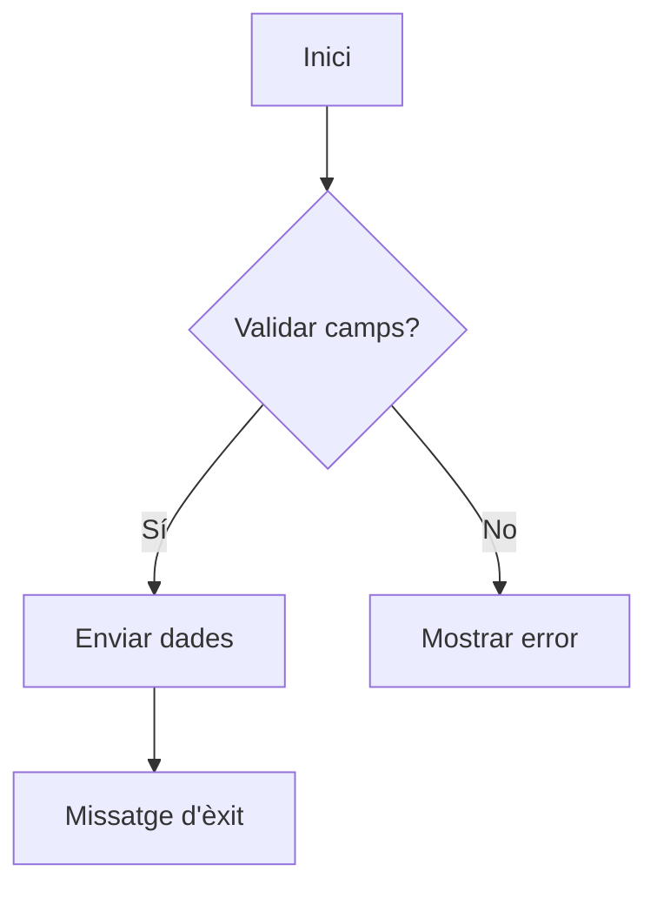
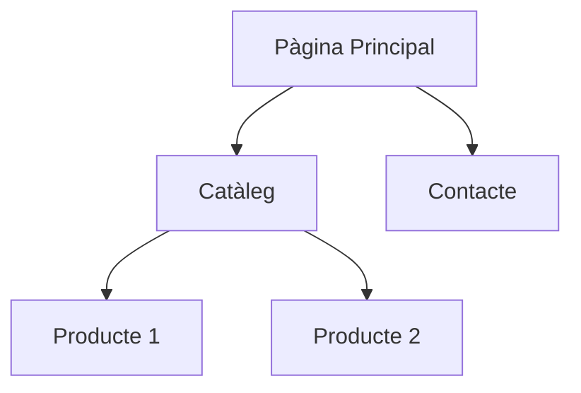
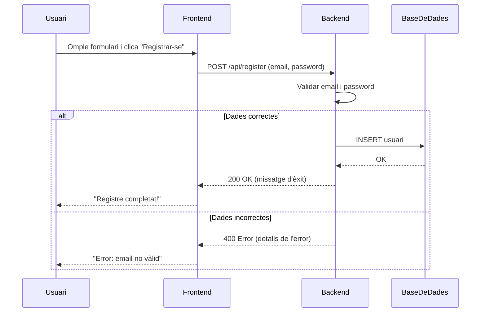

# Tallers
## Taller 1: Creació d’un *User Journey* amb Mermaid:  
   ```mermaid  
   journey  
     title Comprar producte  
     section Accés al lloc  
       Visitar pàgina d'inici: 5: Usuari  
       Cercar producte: 3: Usuari  
     section Compra  
       Afegir al carret: 4: Usuari  
       Finalitzar compra: 5: Usuari  
   ```

   - Definir etapes i punts de dolor amb sintaxi Mermaid.

## Taller 2: Diagrama de flux per a un formulari:


- Convertir un procés de validació de dades a diagrama.

## Taller 3: Sitemap interactiu amb Mermaid + Markdown:


- Exportar el diagrama com a part de la documentació del projecte.

## Exercici pràctic 1: Registre d'usuaris (1 h)  

### Context
Imagina una aplicació web on l’usuari omple un formulari de registre (email i contrasenya). El frontend envia aquestes dades al backend, que valida la informació i retorna una resposta (èxit o error).  

### Objectius d'aprenantatge
Crear un **diagrama de seqüència** amb Mermaid.js que representi la interacció entre el frontend i el backend durant un procés de registre d’usuari.  

### Passos a seguir
1. **Configura Mermaid.js**:  
   - Obre l’[editor en línia de Mermaid](https://mermaid-js.github.io/mermaid-live-editor/) o configura Mermaid al teu entorn local (ex: VS Code amb extensió de Markdown).  

2. **Codi del diagrama**:  
   - Escriu la sintaxi de Mermaid per a un **diagrama de seqüència** que inclogui:  
     - **Actors**: Usuari, Frontend, Backend, Base de dades.  
     - **Passos**:  
       - L’usuari introdueix dades i fa clic a "Registrar-se".  
       - El frontend envia les dades al backend.  
       - El backend valida l’email (ex: format correcte) i la contrasenya (ex: longitud mínima).  
       - Si tot és correcte, el backend guarda les dades a la base de dades i retorna un missatge d’èxit.  
       - Si hi ha errors, el backend retorna un missatge d’error específic.  

3. **Extras (opcional)**:  
   - Afegeix **notes** als passos crítics (ex: "Validar email amb regex").  
   - Inclou un **alt flux** per a un error de connexió amb la base de dades.  


## 💡 **Exemple de codi inicial**  


# Exercici pràctic: Sitemap per a una botiga online amb Draw.io  

## 🎯 **Objectiu**  
Crear un **sitemap** estructurat que representi la jerarquia de pàgines i la navegació d’una botiga online fictícia (ex: "BotigaTech").  

## 📝 **Enunciat**  

### **Escenari**  
La botiga "BotigaTech" ven productes electrònics (mòbils, ordinadors, accessoris) i necessita un sitemap clar per guiar el desenvolupament de la seva aplicació web.  

### **Tasques**  
1. **Configura Draw.io**:  
   - Obre [Draw.io](https://app.diagrams.net/) i tria la plantilla **"Flowchart"** o **"Blank Diagram"**.  

2. **Defineix la jerarquia principal**:  
   - Crea nodes per a les pàgines principals:  
     - **Pàgina d’inici** (`/`)  
     - **Productes** (`/productes`)  
     - **Categories** (`/categories`)  
     - **Cistella** (`/cistella`)  
     - **Compte d’usuari** (`/compte`)  
     - **Contacte** (`/contacte`)  

3. **Afegeix subpàgines**:  
   - Sota **Productes**, inclou:  
     - Detall d’un producte (`/productes/{id}`).  
   - Sota **Categories**, inclou:  
     - Mòbils (`/categories/mobils`), Ordinadors (`/categories/ordinadors`), Accessoris (`/categories/accessoris`).  

4. **Connexions i navegació**:  
   - Uneix els nodes amb fletxes per indicar el flux de navegació.  
   - Exemple: *Pàgina d’inici → Productes → Detall del producte*.  

5. **Elements visuals**:  
   - Utilitza **icones** (Draw.io té una llibreria integrada) per diferenciar tipus de pàgines:  
     - 🛒 per la cistella.  
     - 📱 per categories de mòbils.  

6. **Anotacions (opcional)**:  
   - Afegeix notes als nodes per explicar decisions (ex: "La pàgina de contacte inclou formulari i mapa").  

---

## 💡 **Exemple d’estructura**  
```
┌───────────────┐
│ Pàgina d'inici │
└───────┬───────┘
│
├───────► Productes ───► Detall producte
├───────► Categories ──► Mòbils, Ordinadors...
├───────► Cistella
├───────► Compte ──────► Login, Registre
└───────► Contacte
```

```markdown  
# Exercici pràctic: User flow per a formulari de registre amb Figma Jam  

## 🎯 **Objectiu**  
Dissenyar un **user flow** col·laboratiu per a un formulari de registre, identificant **2 punts de fricció** (on els usuaris podrien abandonar o frustrar-se).  

---

## 📝 **Enunciat**  

### **Escenari**  
Una aplicació de *viatges compartits* necessita un formulari de registre senzill però efectiu. El flux ha de cobrir:  
- Accés des de la pàgina d’inici.  
- Camps obligatoris: *email*, *contrasenya*, *nom complet*.  
- Validació en temps real i missatges d’error clars.  
- Confirmació d’èxit o redirecció a error.  

---

### **Tasques**  
1. **Configura Figma Jam**:  
   - Obre [Figma Jam](https://www.figma.com/jam/) i crea un tauler nou.  
   - Invita un company (opcional) per treballar col·laborativament.  

2. **Dissenya el user flow**:  
   - Utilitza **sticky notes** per a cada pas del flux:  
     - **Entrada**: Botó "Registra’t" a la pàgina d’inici.  
     - **Passos**: Formulari, validació, resposta del servidor.  
     - **Sortides**: Confirmació d’èxit, error de validació, error de servidor.  
   - Connecta els passos amb **fletxes** i afegeix **condicionals** (ex: "Si el mail ja existeix → Mostra error").  

3. **Identifica 2 punts de fricció**:  
   - Marca amb 🟥 els punts problemàtics i afegeix una nota explicant:  
     - *Què passa* (ex: "L’usuari no sap que la contrasenya necessita un símbol").  
     - *Com es pot millorar* (ex: "Afegeix un exemple de contrasenya vàlida").  

4. **Proposta de solució**:  
   - Per a cada punt de fricció, afegeix una **versió millorada** del flux amb sticky notes de color 🟩.  

---

## 💡 **Exemple de user flow**  
```plaintext  
[Entrada] → Clica "Registra’t" → Formulari →  
    ├─ Si dades vàlides → Confirma email → [Èxit]  
    └─ Si dades invàlides → Mostra error → [Torna a formulari]  
```  
**Punts de fricció identificats**:  
1. *Error genèric*: "Hi ha hagut un error" → L’usuari no sap què corregir.  
2. *Confirmació massa llarga*: Redirecció a correu sense feedback visual.  

---

## ✅ **Com validar-ho?**  
1. El flux inclou **com a mínim 5 passos** (entrada, 3 accions, sortida).  
2. Els **2 punts de fricció** estan clarament marcats i justificats.  
3. Les solucions proposades són **específiques** (ex: afegeix un tooltip, millora el missatge d’error).  

---

## 🚀 **Repte extra (opcional)**  
- **Prototipa la solució**: Dissenya un wireframe senzill al costat del user flow.  
- **Prova amb usuaris reals**: Comparteix l’enllaç del tauler amb 2 persones i demana’n feedback.  

---

## 📚 **Recursos**  
- [Tutorial de Figma Jam en 5 minuts](https://www.youtube.com/watch?v=7Z3O7IDFcJk)  
- [Guia de missatges d’error efectius (NN/g)](https://www.nngroup.com/articles/error-messages/)  

**Nota**: Pots adaptar l’exercici a un formulari de login o recuperació de contrasenya.  
```  

### ✨ **Per què aquest exercici?**  
- **Enfocament pràctic**: Aprèn a detectar problemes abans que esdevinguin bugs costosos.  
- **Col·laboració en temps real**: Figma Jam permet treballar amb equips distribuïts.  
- **Iteració ràpida**: Les sticky notes digitals faciliten probar múltiples solucions.