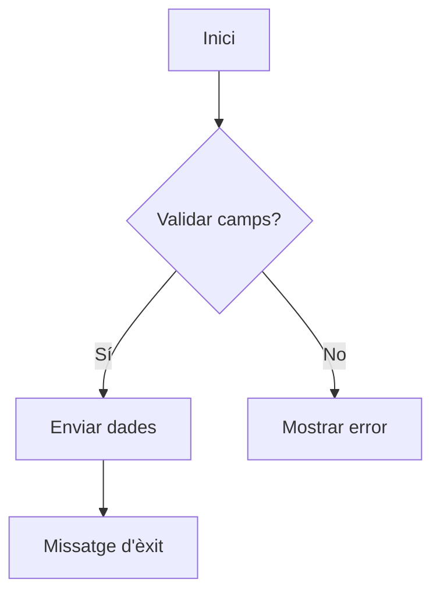
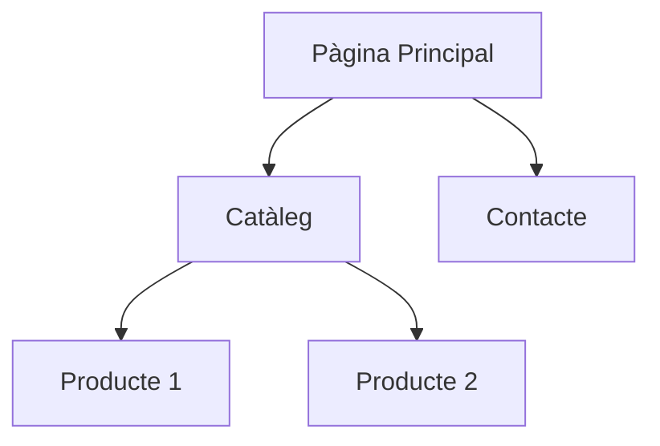

# Tallers
## Taller 1: Creació d’un *User Journey* amb Mermaid:  
   ```mermaid  
   journey  
     title Comprar producte  
     section Accés al lloc  
       Visitar pàgina d'inici: 5: Usuari  
       Cercar producte: 3: Usuari  
     section Compra  
       Afegir al carret: 4: Usuari  
       Finalitzar compra: 5: Usuari  
   ```

   - Definir etapes i punts de dolor amb sintaxi Mermaid.

## Taller 2: Diagrama de flux per a un formulari:


- Convertir un procés de validació de dades a diagrama.

## Taller 3: Sitemap interactiu amb Mermaid + Markdown:


- Exportar el diagrama com a part de la documentació del projecte.