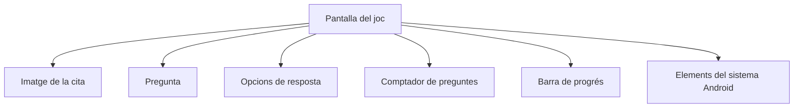

# Tallers
## 1. Crea la carta gráfica de ITAlumni  
   - Objectiu: Utilitzar el disseny proporcionat per a generar la carta gràfica de l'aplicació

## 2. Genera l'estructura atómic-design del disseny
   - Objectiu: Treure els components per crear una biblioteca de components reutilitzables


## Exercici pràctic 1: Wireframing amb Figma per a Unquote Game (2 h)  

## Context
En aquest projecte, aprendràs tècniques professionals de wireframing digital mentre dissenyes la pantalla principal d'Unquote, un joc per Android que desafia els usuaris a corregir cites manipulades trobades a Internet. Per fer aixó utilitzaràs l'eina **Figma** amb plugins especialitzats per a wireframing.


## Configuració inicial de Figma
Abans de començar, configura Figma per a wireframing:
1. Crea un nou fitxer a Figma
2. Activa **Layout Grid** amb columnes de 12px de gutter
3. Instal·la plugins essencials:
   - **Wireframe** (per elements UI bàsics)
   - **Auto Grid** (per a distribució ràpida)
   - **UI Kit** (per components pre-dissenyats)
4. Configura un _frame_ amb mida de dispositiu Android (ex: 412 x 917 px)

## Objectius d'aprenentatge
- Crear wireframes digitals interactius
- Utilitzar components reutilitzables
- Aplicar principis d'arquitectura de la informació
- Optimitzar el flux de treball amb plugins

## Passos a seguir

### 1. Defineix els requisits de la pantalla (15 min)
Crea una llista d'elements necessaris:


### 2. Crea el primer wireframe (30 min)
- Utilitza el plugin **Wireframe** per afegir:
  - Status bar superior
  - Navigation bar inferior
  - Contenidor principal
- Distribueix els elements segons prioritat visual
- **Consell**: Usa Auto Grid per alinear elements ràpidament

> **Referència Figma**  
> [Wireframing Best Practices](https://help.figma.com/hc/en-us/articles/360040450133-Create-a-wireframe)

### 3. Iteració de disseny (45 min)
Crea 3 versions alternatives:
1. Versió jeràrquica (enfoc a imatge gran)
2. Versió minimalista (enfoc a opcions de resposta)
3. Versió experimental (layout no convencional)

**Tècnica recomanada**:  
Usa components amb variants per a botons i elements interactius.

### 4. Prototipatge bàsic (15 min)
1. Connecta les pantalles amb transicions simples
2. Afegeix interaccions bàsiques amb **Smart Animate**
3. Prova el flux amb **Presentation Mode**

### 5. Revisió i documentació (15 min)
1. Exporta els wireframes com a PNG i PDF
2. Afegeix anotacions amb **Comment Tool**
3. Comparteix el projecte amb permisos de visualització

## Questionari d'avaluació

1. Quins elements hauria d'incloure obligatòriament el wireframe segons els requisits?
   - [ ] Música de fons
   - [x] Opcions de resposta múltiple
   - [ ] Publicitat integrada
   - [x] Comptador de preguntes

2. Quin plugin de Figma és més útil per crear components de UI ràpidament?
   - [ ] Image Tracer  
   - [x] Wireframe  
   - [ ] Color Contrast Checker  
   - [ ] Lorem Ipsum  

3. Quina configuració inicial és essencial per a wireframing a Figma?
   - [x] Layout Grid amb columnes de 12px  
   - [ ] Paleta de colors corporativa  
   - [ ] Biblioteca d'icones premium  
   - [ ] Sistema d'animacions complexes  

4. Com es mostra visualment la jerarquia d'informació en un wireframe?
   - [ ] Usant colors vibrants  
   - [x] Mitjançant mida i posicionament d'elements  
   - [ ] Afegint textures 3D  
   - [ ] Incloent codi CSS  

5. Quina és la finalitat principal del wireframing?
   - [ ] Definir la paleta de colors final  
   - [x] Establir l'estructura i flux de la interfície  
   - [ ] Optimitzar el rendiment de l'app  
   - [ ] Crear assets gràfics definitius  

**Puntuació**:  
5 correctes: Nivell expert!  
3-4 correctes: Bé, però revisa la documentació  
0-2 correctes: Recomanem practicar més amb els plugins
```

## Recursos addicionals
- [Guia oficial de wireframing a Figma](https://help.figma.com/hc/en-us/articles/360040450133-Create-a-wireframe)
- [Llista de plugins recomanats](https://www.figma.com/community/plugins/tag/wireframe)
- [Plantilles gratuïtes](https://www.figma.com/community/tag/wireframe/templates)

> **Nota**: Guarda una còpia del teu fitxer Figma amb el format "Unquote_Wireframes_DataActual" per a futura referència.
```
   


